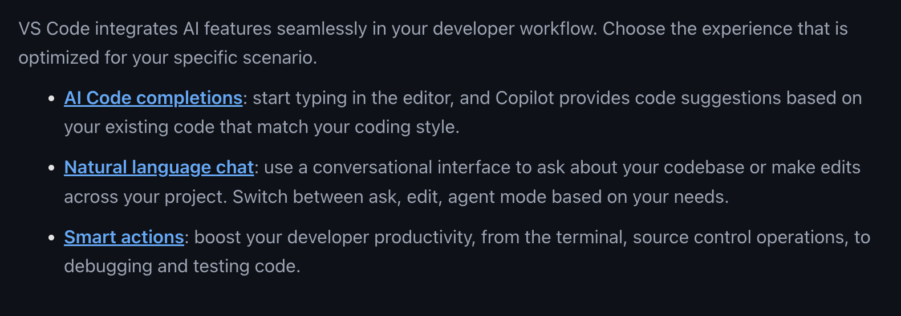

# Copilot ✈️

## Getting Started

[Github Copilot Setup](https://code.visualstudio.com/docs/copilot/setup)

[Github Copilot Settings](https://github.com/settings/copilot)


1. Install the Github Copilot extension in [VS Code](https://docs.github.com/en/copilot/quickstart?tool=vscode)
2. Sign in to your Github account on VS Code.
3. Configure the extension settings to your preference, most importantly choose the model to use.

To get the [Github Copilot Pro Plan](https://github.com/features/copilot/plans?cft=copilot_li.features_copilot) through Kellogg, send an email request to rs@kellogg.northwestern.edu to get added to the Kellogg Github organization. Availalble to stafff, students, and faculty.

## Copilot Uses




- Code completion: Copilot can suggest code completions as you type
    * use the `Tab` key to accept a suggestion
    * use the `Esc` key to dismiss a suggestion
    * use `Cmd-Right` to incrementally accept a suggestion

- Code chat inline: Copilot can suggest entire lines or blocks of code inline
    * use the `Cmd-I` shortcut to insert a suggestion
    * use `/` to insert pre-defined prompts (e.g. `/fix`, `/explain`, `/test`, `/doc`)
    * works in code files, noteooks, and terminal

- Copilot chat: Copilot can provide explanations, suggestions, and code snippets in a chat-like interface
    * use for larger scale code generation and coding tasks
    * can use other parts of the codebase as context (e.g., higlight a chunk of code and use `/explain`)
    * chat has `ask`, `edit`, and `agent` modes
    * available `/` commands depends on mode being used


```{admonition} Exercise
:class: dropdown
Let's try out Copilot.

1. Open a terminal in VS Code, use Cmd-I to insert a suggestion
2. Open a Python file and start typing a function definition (tab key to accept the suggestion).
3. Use the Cmd-I shortcut to insert a suggestion in the python file.
```