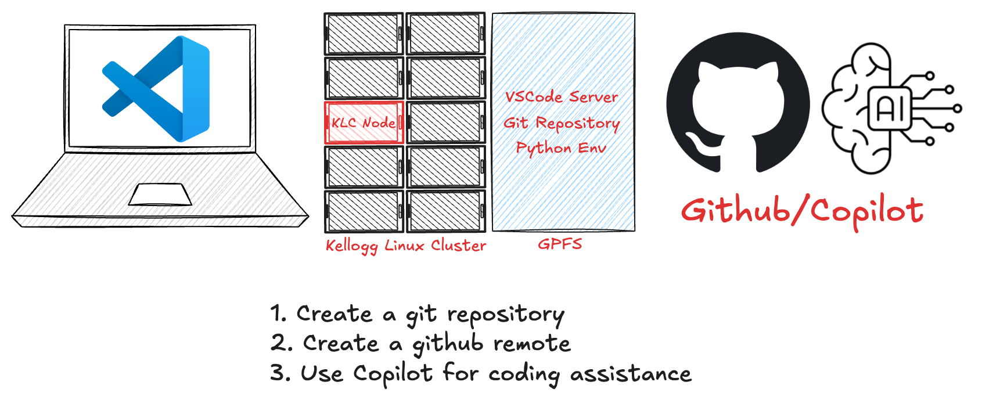

# Github



## Git
Git is a version control system that allows you to track changes in your code. On KLC, git is installed in `/usr/bin/git`. However, this is an old version and we recommend you load a later version with a `module` command:

```bash
module load git/latest
```


## Github
Github is a web-based platform that uses git for version control. It allows you to host your code repositories, collaborate with others, and manage your projects.

### Setting up Github
1. Create a Github account if you don't have one already.
2. Configure your Github account with the CLI by running the following command:
   ```bash
   gh auth login
   ```
3. Follow the prompts to authenticate your account and set up your SSH key.
4. Login to your Github account in VS Code.

### Cloning a repository
1. Open the terminal in VS Code.
2. Navigate to the directory where you want to clone the repository.
3. Run the following command to clone the repository:
   ```bash
   git clone <repository-url>
   ```
4. Replace `<repository-url>` with the URL of the repository you want to clone.

### Authenticating to Github
1. Open the terminal in VS Code.
2. Run the following command to authenticate to Github:
   ```bash
   gh auth login
   ```
3. Follow the prompts to authenticate your account and set up your SSH key.
4. You can also use a personal access token (PAT) for authentication. To create a PAT, go to your Github account settings, navigate to "Developer settings" > "Personal access tokens", and generate a new token with the required scopes.