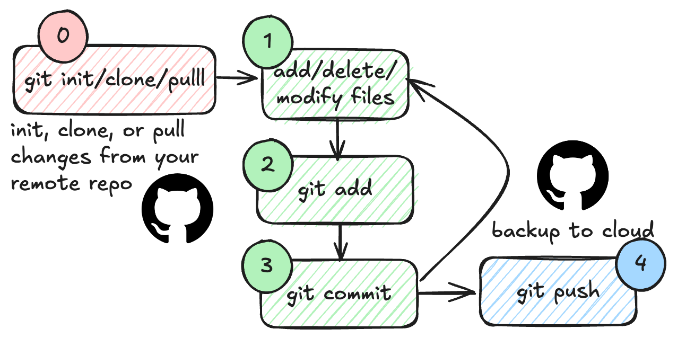

# Github ☁️


## Git
[Git](https://git-scm.com/) is a version control system that allows you to track changes in your code. Originally developed to support development of the Linux kernel by thousands of engineers around the world, it has become the dominant version control system on for all kinds of software development projects. On KLC, git is pre-installed at `/usr/bin/git`. 

```bash
# Check if git is installed
git --version
```


The VS Code source control extension with git support is installed by default:


This extension provides a user-friendly interface for managing your git repositories. You can use it to stage changes, commit code, and push to remote repositories.




## Github
Github is a web-based platform that uses git for version control. It allows you to host your code repositories, collaborate with others, and manage your projects. 

Using git does not require GitHub, but Github is an extremely popular platform for hosting git repositories. You can use Github to store your code, track issues, and collaborate with others. You can create a free account on Github and start hosting your code repositories. Microsoft owns GitHub and is also the primary sponsor of the open-source VS Code tool. As a consequence there is an excellent integration between VS Code and Github, making it easy to manage your code repositories from within the editor.


## Setting up Github in VS Code

1. Create a Github account if you don't have one already.


2. Login to your Github account in VS Code.


3. Open the VS Code extension


```{admonition} Exercise
:class: dropdown
Let's publish our git repository on KLC to Github.

- Open VS Code on KLC using the remote extension.
- Click on the Source Control icon in the left sidebar.
- Click on the `Publish Branch` button and follow the prompts
- View the repository on Github.
```

```{admonition} Exercise
:class: dropdown
Now let's clone the repo to your local machine (or another KLC folder if you don't have git installed on your local machine).

-  Open VS Code on your local machine.
- Click on the Source Control icon in the left sidebar.
- Click on the `Clone Repository` button and follow the prompts
- Make some changes to the code and commit them.
- Push the changes to the remote repository on Github.
- View the changes on Github.
```